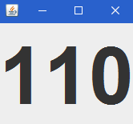
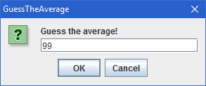
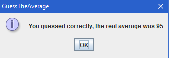
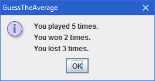

# Guess the Average

Try to calculate the average of the appearing numbers.

 

 

## Gameplay & Features

- Watch the changing numbers and try to calculate the average of them.
- Enter your guess after all numbers have appeared.
- Give up by pressing _G_.
- Pause the game by pressing _P_.
- Pausing automatically when window loses focus.
- Viewing statistics at the end.

There are some customization options for adding variety. You can set these options using _GuessTheAverageConfiguration.ini_ file after building (Hard-coding options into code is not necessary). This file is read before every round so you can play each round with different options.

## Customizations

- Specify the size of the label.
- Set how many numbers appear in one second.
- Specify how many numbers appear in total.
- Set a lower and an upper limit for the numbers.
- Specify the tolerance (average - tolerance <= guess <= average + tolerance).
